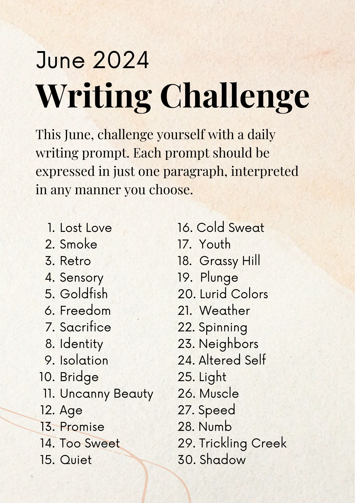

# June 2024 Writing Challenge

----

Reading and practicing writing daily has been the standard advice for improving writing quality. However, if it were that easy, I suspect we would have many more amazing writers than we already do. Thus, in the spirit of another challenge I did back in 2018 for illustration, I embarked on a personal writing challenge to see if it made me a better writer at the end. 

Though its hard to quantify due to the subjective nature of writing, I have found this challenge has given me a new way of scrutinizing my own work. Although I broke the one paragraph rule a few times, the fact I had to keep most of them to only a paragraph forced me to weigh every word. As a result, my writing has become more concise, a quality that I lacked up until this challenge.

## Fair warning

Some of my snippets could be considered rated R in nature due to violence and mild sexual themes. Specifically days 11, 13, 24, and 29. Reader discretion advised for those days.

## Challenge specifics

